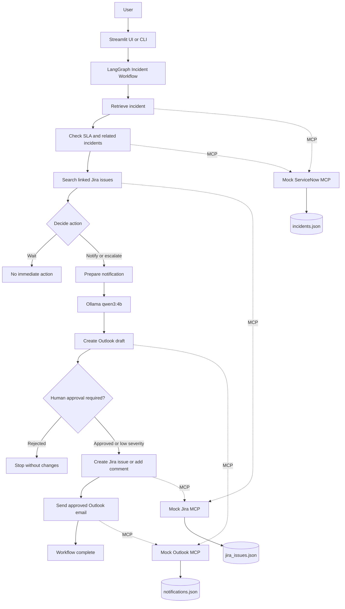

# Incident Triage Agent

A fictional learning project that uses LangChain, LangGraph, local Ollama models, and mock MCP servers to triage ServiceNow incidents, coordinate Jira engineering work, and prepare Outlook notifications.

## Architecture



LangGraph owns the control flow and state. LangChain MCP adapters expose the three mock systems as tools. Ollama drafts notification text, while deterministic Python rules enforce triage, validation, duplicate prevention, and approval controls.

## Workflow

1. Retrieve a fictional ServiceNow incident.
2. Check its priority, SLA, and related incidents.
3. Search Jira for an existing linked issue.
4. Decide whether to wait, notify, or escalate.
5. Draft an internal Outlook notification using local Ollama.
6. Pause P1/P2 workflows for human approval.
7. Create or update the Jira issue and send the approved email.

## MCP Tools

| System | Tool | Purpose |
|---|---|---|
| ServiceNow | `get_incident` | Retrieve one incident |
| ServiceNow | `get_incident_sla` | Check SLA and escalation status |
| ServiceNow | `search_related_incidents` | Find similar incidents |
| Jira | `search_jira_issues` | Find linked engineering work |
| Jira | `create_jira_issue` | Create an approved Story, Task, or Bug |
| Jira | `add_jira_comment` | Add an approved incident update |
| Outlook | `create_email_draft` | Create an allowlisted draft |
| Outlook | `send_email` | Send an existing approved draft |

## Safety Controls

- P1 and P2 Jira and email actions require human approval.
- External Outlook recipients are blocked.
- Duplicate Jira issues are prevented.
- Jira projects and issue types are allowlisted.
- Incident numbers must match `INC` followed by seven digits.
- Empty Jira comments are rejected.
- Emails cannot be sent twice.
- The agent never closes or deletes incidents or Jira issues.
- Ollama drafts text; deterministic code makes operational decisions.

## Project Structure

```text
incident-triage-agent/
├── data/                  # Fictional JSON databases
├── servers/               # Mock ServiceNow, Jira, and Outlook MCP servers
├── src/                   # MCP client, LangGraph state, nodes, workflow, and LLM
├── tests/                 # Automated safety and tool tests
├── app.py                 # Command-line interface
├── streamlit_app.py       # Streamlit interface
└── requirements.txt
```

## Local Setup

```bash
python3 -m venv .venv
source .venv/bin/activate
pip install -r requirements.txt
ollama pull qwen3:4b
cp .env.example .env
```

The compatible MCP dependency is pinned to the 1.x line because the current LangChain MCP adapter uses the MCP 1.x context API.

## Run the Application

Command line:

```bash
python app.py
```

Streamlit:

```bash
streamlit run streamlit_app.py
```

Example incidents include `INC0010001`, `INC0010002`, and `INC0010003`.

## Test

```bash
pytest -q
```

Current result:

```text
18 passed
```

To inspect one mock MCP server manually:

```bash
mcp dev servers/servicenow_server.py
```

## Success Criteria

The MVP succeeds when it retrieves an incident, checks SLA and related records, chooses the Jira action, drafts a notification, pauses for required approval, and completes the approved Jira and Outlook actions.

## Lessons Learned

- MCP separates tool implementations from agent orchestration.
- LangGraph makes state, branching, and human approval explicit.
- Local models can draft useful text without sending organisational data to a hosted model.
- Deterministic rules are better suited to safety and permission checks.
- Test-first development catches malformed input and prevents regressions.
- Dependency compatibility matters: MCP 2.x was incompatible with the adapter version used by this project.

## Limitations

- ServiceNow, Jira, and Outlook are fictional JSON-backed mock servers.
- Graph state is kept in memory and is lost when the process stops.
- Authentication, automatic polling, calendar bridge creation, persistent databases, and production deployment are outside the MVP scope.
- The project is intended for local learning and demonstration.
