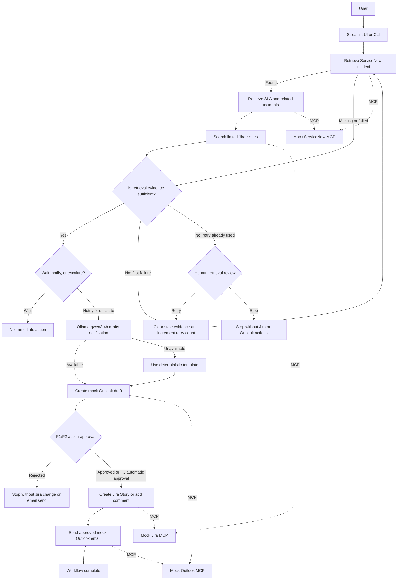

# Incident Triage Agent

A fictional learning project that uses LangChain, LangGraph, local Ollama models, and mock MCP servers to triage ServiceNow incidents, coordinate Jira engineering work, and prepare Outlook notifications.

## Architecture



LangGraph owns the control flow and state. LangChain MCP adapters expose the three mock systems as tools. Ollama drafts notification text, while deterministic Python rules enforce triage, validation, duplicate prevention, and approval controls.
## Agentic Retrieval Decision Loop

The workflow does not assume that one retrieval attempt is sufficient. After collecting ServiceNow and Jira evidence, the `assess_evidence` node checks that the incident fields, SLA result, related-incident result, and Jira search result are complete and structurally valid.

If evidence is incomplete, LangGraph conditionally loops back and retries retrieval once. If the second attempt is still incomplete, the workflow pauses for human review and performs no Jira or Outlook actions. This observe-decide-retry-or-escalate behaviour provides the agentic retrieval loop while deterministic validation keeps operational decisions safe and testable.
## Full Execution Path

A successful high-severity execution follows this path:

```text
User submits incident
→ retrieve_incident
→ enrich_incident
→ search_jira
→ assess_evidence
→ decide_action
→ prepare_notification
→ Ollama generates the draft
→ create_email_draft
→ human_approval interrupt
→ execute_jira_action
→ send_notification
→ complete
```

An incomplete retrieval follows this path:

```text
retrieve
→ assess evidence as insufficient
→ clear stale evidence
→ retry retrieval once
→ assess evidence again
→ retrieval_human_review interrupt
→ human retries or stops safely
```

## Human Review Decisions

Human review is required at two different stages:

1. **Retrieval review:** If required evidence remains incomplete after one automatic retry, the graph pauses. A human can request another retry or stop the workflow. No Jira issue, Jira comment, Outlook draft, or email send is performed while retrieval remains unresolved.
2. **Action approval:** P1 and P2 incidents pause after the proposed notification has been prepared. A human reviews the incident, Jira action, subject, and body before Jira changes or email sending are allowed.

P3 notifications may proceed automatically because the project uses fictional data and the mock tools independently enforce recipient allowlists, Jira project and issue-type allowlists, duplicate prevention, and email-send protection. P4 incidents stop at the `wait` decision.

## Ollama Drafting

The `prepare_notification` LangGraph node calls the local Ollama model through `generate_email_body()`. The resulting state records `draft_source: ollama`, which demonstrates that the model was part of the execution path.

If Ollama is unavailable, the node records `draft_source: template_fallback` and uses a deterministic notification template. Ollama drafts text only; deterministic Python rules control evidence validation, triage, permissions, and approval.

## Workflow

1. Retrieve a fictional ServiceNow incident.
2. Check its priority, SLA, and related incidents.
3. Search Jira for an existing linked issue.
4. Decide whether to wait, notify, or escalate.
5. Draft an internal Outlook notification using local Ollama.
6. Pause P1/P2 workflows for human approval.
7. Create or update the Jira issue and send the approved email.

## MCP Tools

| System | Tool | Purpose |
|---|---|---|
| ServiceNow | `get_incident` | Retrieve one incident |
| ServiceNow | `get_incident_sla` | Check SLA and escalation status |
| ServiceNow | `search_related_incidents` | Find similar incidents |
| Jira | `search_jira_issues` | Find linked engineering work |
| Jira | `create_jira_issue` | Create an approved Story, Task, or Bug |
| Jira | `add_jira_comment` | Add an approved incident update |
| Outlook | `create_email_draft` | Create an allowlisted draft |
| Outlook | `send_email` | Send an existing approved draft |

## Safety Controls

- P1 and P2 Jira and email actions require human approval.
- External Outlook recipients are blocked.
- Duplicate Jira issues are prevented.
- Jira projects and issue types are allowlisted.
- Incident numbers must match `INC` followed by seven digits.
- Empty Jira comments are rejected.
- Emails cannot be sent twice.
- The agent never closes or deletes incidents or Jira issues.
- Ollama drafts text; deterministic code makes operational decisions.

## Project Structure

```text
incident-triage-agent/
├── data/                  # Fictional JSON databases
├── servers/               # Mock ServiceNow, Jira, and Outlook MCP servers
├── src/                   # MCP client, LangGraph state, nodes, workflow, and LLM
├── tests/                 # Automated safety and tool tests
├── app.py                 # Command-line interface
├── streamlit_app.py       # Streamlit interface
└── requirements.txt
```

## Local Setup

```bash
python3 -m venv .venv
source .venv/bin/activate
pip install -r requirements.txt
ollama pull qwen3:4b
cp .env.example .env
```

The compatible MCP dependency is pinned to the 1.x line because the current LangChain MCP adapter uses the MCP 1.x context API.

## Run the Application

Command line:

```bash
python app.py
```

Streamlit:

```bash
streamlit run streamlit_app.py
```

Example incidents include `INC0010001`, `INC0010002`, and `INC0010003`.

## Test

```bash
pytest -q
```

Current result:

```text
42 passed
```

To inspect one mock MCP server manually:

```bash
mcp dev servers/servicenow_server.py
```

## Success Criteria

The MVP succeeds when it retrieves an incident, checks SLA and related records, chooses the Jira action, drafts a notification, pauses for required approval, and completes the approved Jira and Outlook actions.

## Lessons Learned

- MCP separates tool implementations from agent orchestration.
- LangGraph makes state, branching, and human approval explicit.
- Local models can draft useful text without sending organisational data to a hosted model.
- Deterministic rules are better suited to safety and permission checks.
- Test-first development catches malformed input and prevents regressions.
- Dependency compatibility matters: MCP 2.x was incompatible with the adapter version used by this project.

## Limitations

- ServiceNow, Jira, and Outlook are fictional JSON-backed mock servers.
- Graph state is kept in memory and is lost when the process stops.
- Authentication, automatic polling, calendar bridge creation, persistent databases, and production deployment are outside the MVP scope.
- The project is intended for local learning and demonstration.