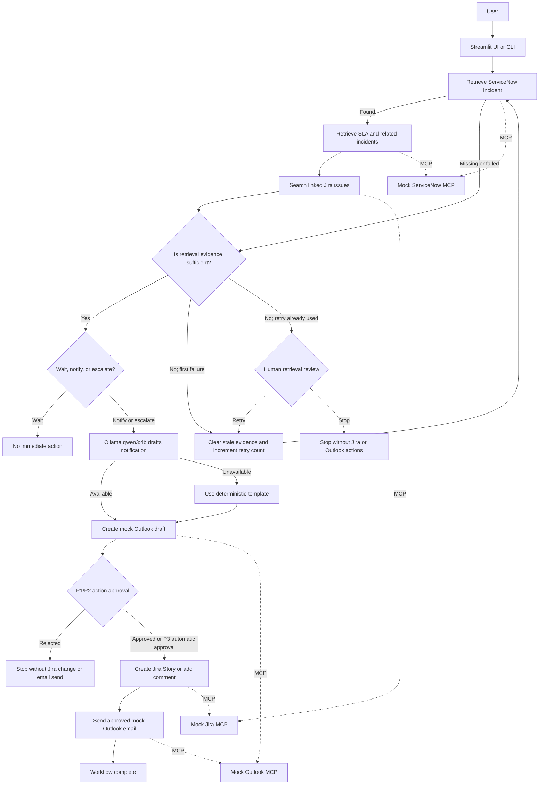

# Week 3 Incident Triage Feedback Repair Implementation Plan
> **For agentic workers:** REQUIRED SUB-SKILL: Use `superpowers:executing-plans` to implement this plan task by task. Each task follows test-driven development.

**Goal:** Complete the Week 3 Incident Triage Agent by connecting the verified Ollama drafting path to an agentic retrieval assessment and retry loop, with documented human-review controls and full execution evidence.

**Architecture:** Deterministic Python validates retrieved ServiceNow and Jira evidence. LangGraph conditionally continues, retries retrieval once, or pauses for human assistance; Ollama drafts notification text while deterministic rules retain control of safety and operational decisions.

**Tech Stack:** Python 3.14, LangChain, LangGraph, Ollama `qwen3:4b`, LangChain MCP adapters, mock ServiceNow/Jira/Outlook MCP servers, Streamlit, pytest.

**Spec:** `docs/superpowers/specs/2026-09-05-week3-feedback-repair-design.md`

## Global Constraints

- Use local Ollama only; do not add a paid model.
- Never allow unresolved retrieval failures to reach Jira or Outlook write actions.
- Preserve the existing P1/P2 human-approval requirement.
- Preserve the existing recipient, Jira project, issue type, duplicate, and send safeguards.
- Retry incomplete retrieval automatically no more than once.
- Do not modify the user’s original mock JSON data while testing.
- Use tests before implementation and commit each completed task separately.

---

### Task 1: Add Deterministic Evidence Assessment

**Files:**

- Create: `tests/test_evidence_assessment.py`
- Modify: `src/nodes.py`
- Modify: `src/state.py`

**Interfaces:**

- Consumes: `IncidentState` containing `incident`, `sla`, `related_incidents`, and `jira_search`.
- Produces: `assess_evidence(state: IncidentState) -> dict`.
- Returns: `evidence_status`, `missing_evidence`, and `stage`.

- [ ] **Step 1: Create the failing tests**

Create `tests/test_evidence_assessment.py`:

```python
import pytest

from src.nodes import assess_evidence


COMPLETE_STATE = {
    "incident_number": "INC0010001",
    "incident": {
        "number": "INC0010001",
        "short_description": "Email unavailable",
        "description": "Employees cannot send email.",
        "priority": "P1",
        "state": "New",
        "assignment_group": "Messaging Support",
        "engineering_required": True,
    },
    "sla": {
        "incident_number": "INC0010001",
        "sla_breached": False,
    },
    "related_incidents": {
        "incident_number": "INC0010001",
        "related_incidents": [],
        "total": 0,
    },
    "jira_search": {
        "incident_number": "INC0010001",
        "issues": [],
        "total": 0,
    },
}


@pytest.mark.asyncio
async def test_complete_evidence_is_sufficient():
    result = await assess_evidence(COMPLETE_STATE)

    assert result["evidence_status"] == "sufficient"
    assert result["missing_evidence"] == []
    assert result["stage"] == "evidence_assessed"


@pytest.mark.asyncio
async def test_missing_jira_evidence_is_insufficient():
    incomplete_state = {
        **COMPLETE_STATE,
        "jira_search": {
            "incident_number": "INC0010001",
            "issues": [],
        },
    }

    result = await assess_evidence(incomplete_state)

    assert result["evidence_status"] == "insufficient"
    assert "jira_search.total" in result["missing_evidence"]


@pytest.mark.asyncio
async def test_malformed_incident_is_insufficient():
    incomplete_state = {
        **COMPLETE_STATE,
        "incident": {
            "number": "INC0010001",
            "priority": "P1",
        },
    }

    result = await assess_evidence(incomplete_state)

    assert result["evidence_status"] == "insufficient"
    assert "incident.description" in result["missing_evidence"]
```

- [ ] **Step 2: Run the tests and confirm RED**

Run:

```bash
pytest tests/test_evidence_assessment.py -v
```

Expected result: test collection fails because `assess_evidence` does not exist yet.

- [ ] **Step 3: Add evidence fields to the graph state**

Add these entries inside `IncidentState` in `src/state.py`:

```python
    evidence_status: NotRequired[str]
    missing_evidence: NotRequired[list[str]]
```

- [ ] **Step 4: Implement the evidence checker**

Add this function to `src/nodes.py` immediately before `decide_action`:

```python
async def assess_evidence(
    state: IncidentState,
) -> dict:
    """Check whether retrieved evidence is complete and valid."""
    missing: list[str] = []

    incident = state.get("incident")
    incident_fields = {
        "number",
        "short_description",
        "description",
        "priority",
        "state",
        "assignment_group",
        "engineering_required",
    }

    if not isinstance(incident, dict):
        missing.append("incident")
    else:
        for field in sorted(incident_fields):
            if field not in incident:
                missing.append(f"incident.{field}")

    sla = state.get("sla")

    if not isinstance(sla, dict):
        missing.append("sla")
    elif "sla_breached" not in sla:
        missing.append("sla.sla_breached")

    related = state.get("related_incidents")

    if not isinstance(related, dict):
        missing.append("related_incidents")
    else:
        if not isinstance(
            related.get("related_incidents"),
            list,
        ):
            missing.append(
                "related_incidents.related_incidents"
            )

        if not isinstance(related.get("total"), int):
            missing.append("related_incidents.total")

    jira_search = state.get("jira_search")

    if not isinstance(jira_search, dict):
        missing.append("jira_search")
    else:
        if not isinstance(jira_search.get("issues"), list):
            missing.append("jira_search.issues")

        if not isinstance(jira_search.get("total"), int):
            missing.append("jira_search.total")

    return {
        "evidence_status": (
            "sufficient"
            if not missing
            else "insufficient"
        ),
        "missing_evidence": missing,
        "stage": "evidence_assessed",
    }
```

- [ ] **Step 5: Run the focused and complete test suites**

Run:

```bash
pytest tests/test_evidence_assessment.py -v
pytest -q
```

Expected result: the three new tests and all existing tests pass.

- [ ] **Step 6: Commit Task 1**

```bash
git add src/nodes.py src/state.py tests/test_evidence_assessment.py
git commit -m "feat: assess retrieved incident evidence"
```
---

### Task 2: Add the Retrieval Retry and Human-Review Loop

**Files:**

- Create: `tests/test_retrieval_routing.py`
- Modify: `src/state.py`
- Modify: `src/workflow.py`

**Interfaces:**

- Consumes: `evidence_status`, `missing_evidence`, and `retry_count`.
- Produces: `prepare_retrieval_retry(state) -> dict`.
- Produces: `route_after_evidence(state) -> str`.
- Produces: `retrieval_human_review(state) -> dict`.
- Produces: `route_after_retrieval_review(state) -> str`.

- [ ] **Step 1: Create routing tests**

Create `tests/test_retrieval_routing.py`:

```python
from src.workflow import (
    prepare_retrieval_retry,
    route_after_evidence,
    route_after_retrieval,
    route_after_retrieval_review,
)


def test_sufficient_evidence_continues():
    state = {
        "evidence_status": "sufficient",
        "retry_count": 0,
    }

    assert route_after_evidence(state) == "continue"


def test_first_incomplete_result_retries():
    state = {
        "evidence_status": "insufficient",
        "retry_count": 0,
    }

    assert route_after_evidence(state) == "retry"


def test_second_incomplete_result_requests_human():
    state = {
        "evidence_status": "insufficient",
        "retry_count": 1,
    }

    assert route_after_evidence(state) == "human_review"


def test_retry_preparation_clears_old_evidence():
    state = {
        "retry_count": 0,
        "incident": {"number": "INC0010001"},
        "sla": {"sla_breached": False},
        "related_incidents": {"total": 0},
        "jira_search": {"total": 0},
        "error": "old error",
    }

    result = prepare_retrieval_retry(state)

    assert result["retry_count"] == 1
    assert result["incident"] == {}
    assert result["sla"] == {}
    assert result["related_incidents"] == {}
    assert result["jira_search"] == {}
    assert result["error"] is None
    assert result["stage"] == "retrieval_retry_prepared"


def test_failed_incident_retrieval_is_assessed():
    state = {
        "error": "Incident was not found.",
    }

    assert route_after_retrieval(state) == "assess"


def test_human_can_request_another_retry():
    state = {
        "retrieval_review_action": "retry",
    }

    assert route_after_retrieval_review(state) == "retry"


def test_human_can_stop_retrieval():
    state = {
        "retrieval_review_action": "stop",
    }

    assert route_after_retrieval_review(state) == "stop"
```

- [ ] **Step 2: Run the tests and confirm RED**

```bash
pytest tests/test_retrieval_routing.py -v
```

Expected result: test collection fails because the new routing functions do not exist.

- [ ] **Step 3: Add retrieval-review fields to the state**

Add these entries inside `IncidentState` in `src/state.py`:

```python
    retrieval_review_action: NotRequired[str]
    retrieval_feedback: NotRequired[str]
```

Change the existing `error` entry to allow it to be cleared:

```python
    error: NotRequired[str | None]
```

- [ ] **Step 4: Import the evidence node**

Add `assess_evidence` to the import list from `src.nodes` in `src/workflow.py`:

```python
from src.nodes import (
    assess_evidence,
    decide_action,
    enrich_incident,
    execute_jira_action,
    prepare_notification,
    retrieve_incident,
    search_jira,
    send_notification,
)
```

- [ ] **Step 5: Add retry preparation**

Add this function above `build_workflow()` in `src/workflow.py`:

```python
def prepare_retrieval_retry(
    state: IncidentState,
) -> dict:
    """Clear old evidence before another retrieval attempt."""
    return {
        "retry_count": state.get("retry_count", 0) + 1,
        "incident": {},
        "sla": {},
        "related_incidents": {},
        "jira_search": {},
        "evidence_status": "pending",
        "missing_evidence": [],
        "error": None,
        "stage": "retrieval_retry_prepared",
    }
```

Clearing the old values prevents stale evidence from an earlier attempt from being treated as current evidence.

- [ ] **Step 6: Change the route after primary retrieval**

Replace `route_after_retrieval` with:

```python
def route_after_retrieval(
    state: IncidentState,
) -> str:
    """Continue retrieval or assess a failed result."""
    if state.get("error"):
        return "assess"

    return "continue"
```

- [ ] **Step 7: Add the evidence route**

Add:

```python
def route_after_evidence(
    state: IncidentState,
) -> str:
    """Continue, retry once, or request human help."""
    if state.get("evidence_status") == "sufficient":
        return "continue"

    if state.get("retry_count", 0) < 1:
        return "retry"

    return "human_review"
```

- [ ] **Step 8: Add the retrieval human-review node**

Add:

```python
def retrieval_human_review(
    state: IncidentState,
) -> dict:
    """Pause when evidence remains incomplete."""
    response = interrupt(
        {
            "review_type": "retrieval",
            "message": (
                "Retrieval remains incomplete after one retry."
            ),
            "incident_number": state["incident_number"],
            "missing_evidence": state.get(
                "missing_evidence",
                [],
            ),
            "error": state.get("error"),
            "allowed_actions": ["retry", "stop"],
        }
    )

    if isinstance(response, dict):
        retry = bool(response.get("retry", False))
        feedback = str(response.get("feedback", ""))
    else:
        retry = False
        feedback = ""

    return {
        "retrieval_review_action": (
            "retry"
            if retry
            else "stop"
        ),
        "retrieval_feedback": feedback,
        "stage": (
            "retrieval_retry_requested"
            if retry
            else "retrieval_stopped"
        ),
    }
```

- [ ] **Step 9: Add the route after retrieval review**

Add:

```python
def route_after_retrieval_review(
    state: IncidentState,
) -> str:
    """Follow the human retrieval-review decision."""
    if state.get("retrieval_review_action") == "retry":
        return "retry"

    return "stop"
```

- [ ] **Step 10: Register the new nodes**

Inside `build_workflow()`, add:

```python
    builder.add_node(
        "assess_evidence",
        assess_evidence,
    )
    builder.add_node(
        "prepare_retrieval_retry",
        prepare_retrieval_retry,
    )
    builder.add_node(
        "retrieval_human_review",
        retrieval_human_review,
    )
```

- [ ] **Step 11: Update the graph edges**

Replace the existing conditional edges after `retrieve_incident` with:

```python
    builder.add_conditional_edges(
        "retrieve_incident",
        route_after_retrieval,
        {
            "continue": "enrich_incident",
            "assess": "assess_evidence",
        },
    )
```

Replace:

```python
    builder.add_edge(
        "search_jira",
        "decide_action",
    )
```

with:

```python
    builder.add_edge(
        "search_jira",
        "assess_evidence",
    )
```

Add these edges immediately afterward:

```python
    builder.add_conditional_edges(
        "assess_evidence",
        route_after_evidence,
        {
            "continue": "decide_action",
            "retry": "prepare_retrieval_retry",
            "human_review": "retrieval_human_review",
        },
    )

    builder.add_edge(
        "prepare_retrieval_retry",
        "retrieve_incident",
    )

    builder.add_conditional_edges(
        "retrieval_human_review",
        route_after_retrieval_review,
        {
            "retry": "prepare_retrieval_retry",
            "stop": END,
        },
    )
```

- [ ] **Step 12: Run the focused tests**

```bash
pytest tests/test_retrieval_routing.py -v
```

Expected result: all seven routing tests pass.

- [ ] **Step 13: Run the complete suite**

```bash
pytest -q
```

Expected result: all existing and new tests pass.

- [ ] **Step 14: Commit Task 2**

```bash
git add src/state.py src/workflow.py tests/test_retrieval_routing.py
git commit -m "feat: add agentic retrieval retry loop"
```
---

### Task 3: Capture Retrieval Tool Failures in Graph State

**Files:**

- Create: `tests/test_retrieval_errors.py`
- Modify: `src/nodes.py`

**Interfaces:**

- Consumes: MCP results or exceptions from `call_tool`.
- Produces: safe retrieval dictionaries, `error`, and a failure stage.
- Ensures: tool failures reach `assess_evidence` instead of crashing.

- [ ] **Step 1: Create failing error-handling tests**

Create `tests/test_retrieval_errors.py`:

```python
import pytest

import src.nodes as nodes


@pytest.mark.asyncio
async def test_incident_exception_becomes_state_error(
    monkeypatch,
):
    async def failing_tool(*args, **kwargs):
        raise RuntimeError("ServiceNow unavailable")

    monkeypatch.setattr(nodes, "call_tool", failing_tool)

    result = await nodes.retrieve_incident(
        {"incident_number": "INC0010001"}
    )

    assert result["incident"] == {}
    assert "get_incident failed" in result["error"]
    assert result["stage"] == "incident_retrieval_failed"


@pytest.mark.asyncio
async def test_enrichment_collects_partial_failures(
    monkeypatch,
):
    async def partly_failing_tool(tool_name, arguments):
        if tool_name == "get_incident_sla":
            raise RuntimeError("SLA unavailable")

        return {
            "incident_number": arguments["incident_number"],
            "related_incidents": [],
            "total": 0,
        }

    monkeypatch.setattr(
        nodes,
        "call_tool",
        partly_failing_tool,
    )

    result = await nodes.enrich_incident(
        {"incident_number": "INC0010001"}
    )

    assert result["sla"] == {}
    assert result["related_incidents"]["total"] == 0
    assert "get_incident_sla failed" in result["error"]
    assert result["stage"] == "incident_enrichment_failed"


@pytest.mark.asyncio
async def test_jira_exception_becomes_state_error(
    monkeypatch,
):
    async def failing_tool(*args, **kwargs):
        raise RuntimeError("Jira unavailable")

    monkeypatch.setattr(nodes, "call_tool", failing_tool)

    result = await nodes.search_jira(
        {"incident_number": "INC0010001"}
    )

    assert result["jira_search"] == {}
    assert "search_jira_issues failed" in result["error"]
    assert result["stage"] == "jira_search_failed"
```

- [ ] **Step 2: Run the tests and confirm RED**

```bash
pytest tests/test_retrieval_errors.py -v
```

Expected result: all three tests fail because the current retrieval nodes allow exceptions to escape.

- [ ] **Step 3: Replace `retrieve_incident`**

Replace the existing function in `src/nodes.py` with:

```python
async def retrieve_incident(
    state: IncidentState,
) -> dict:
    """Retrieve the primary ServiceNow incident safely."""
    try:
        incident = await call_tool(
            "get_incident",
            {
                "incident_number": state["incident_number"],
            },
        )
    except Exception as error:
        return {
            "incident": {},
            "stage": "incident_retrieval_failed",
            "error": (
                "get_incident failed: "
                f"{type(error).__name__}"
            ),
        }

    if "error" in incident:
        return {
            "incident": {},
            "stage": "incident_retrieval_failed",
            "error": str(incident["error"]),
        }

    return {
        "incident": incident,
        "stage": "incident_retrieved",
        "error": None,
    }
```

- [ ] **Step 4: Replace `enrich_incident`**

Replace the existing function with:

```python
async def enrich_incident(
    state: IncidentState,
) -> dict:
    """Retrieve SLA and related incidents safely."""
    incident_number = state["incident_number"]
    errors: list[str] = []

    try:
        sla = await call_tool(
            "get_incident_sla",
            {"incident_number": incident_number},
        )
    except Exception as error:
        sla = {}
        errors.append(
            "get_incident_sla failed: "
            f"{type(error).__name__}"
        )

    try:
        related = await call_tool(
            "search_related_incidents",
            {"incident_number": incident_number},
        )
    except Exception as error:
        related = {}
        errors.append(
            "search_related_incidents failed: "
            f"{type(error).__name__}"
        )

    return {
        "sla": sla,
        "related_incidents": related,
        "error": "; ".join(errors) if errors else None,
        "stage": (
            "incident_enrichment_failed"
            if errors
            else "incident_enriched"
        ),
    }
```

- [ ] **Step 5: Replace `search_jira`**

Replace the existing function with:

```python
async def search_jira(
    state: IncidentState,
) -> dict:
    """Search Jira safely for an existing linked issue."""
    try:
        jira_search = await call_tool(
            "search_jira_issues",
            {
                "incident_number": state[
                    "incident_number"
                ],
            },
        )
    except Exception as error:
        return {
            "jira_search": {},
            "error": (
                "search_jira_issues failed: "
                f"{type(error).__name__}"
            ),
            "stage": "jira_search_failed",
        }

    if "error" in jira_search:
        return {
            "jira_search": {},
            "error": str(jira_search["error"]),
            "stage": "jira_search_failed",
        }

    return {
        "jira_search": jira_search,
        "stage": "jira_searched",
    }
```

Do not return `error: None` from a successful Jira search. If the earlier SLA or related-incident retrieval failed, its error must remain in the graph state until the retry begins.

- [ ] **Step 6: Run the focused tests**

```bash
pytest tests/test_retrieval_errors.py -v
```

Expected result: all three tests pass.

- [ ] **Step 7: Run all retrieval tests**

```bash
pytest \
  tests/test_evidence_assessment.py \
  tests/test_retrieval_routing.py \
  tests/test_retrieval_errors.py \
  -v
```

Expected result: all evidence, routing, and error tests pass.

- [ ] **Step 8: Run the complete suite**

```bash
pytest -q
```

Expected result: all tests pass.

- [ ] **Step 9: Commit Task 3**

```bash
git add src/nodes.py tests/test_retrieval_errors.py
git commit -m "fix: route retrieval failures through evidence review"
```
---

### Task 4: Support Both Human-Review Types in the User Interfaces

**Files:**

- Create: `src/review.py`
- Create: `tests/test_review.py`
- Modify: `src/workflow.py`
- Modify: `app.py`
- Modify: `streamlit_app.py`

**Interfaces:**

- Produces: `is_retrieval_review(request: dict) -> bool`.
- Produces: `build_review_response(request: dict, accepted: bool, feedback: str) -> dict`.
- Ensures: CLI and Streamlit send the correct resume data for each interrupt type.

- [ ] **Step 1: Create the review-helper tests**

Create `tests/test_review.py`:

```python
from src.review import (
    build_review_response,
    is_retrieval_review,
)


def test_identifies_retrieval_review():
    request = {"review_type": "retrieval"}

    assert is_retrieval_review(request) is True


def test_identifies_action_review():
    request = {"review_type": "action"}

    assert is_retrieval_review(request) is False


def test_builds_retrieval_retry_response():
    response = build_review_response(
        {"review_type": "retrieval"},
        accepted=True,
        feedback="ServiceNow is available again.",
    )

    assert response == {
        "retry": True,
        "feedback": "ServiceNow is available again.",
    }


def test_builds_action_approval_response():
    response = build_review_response(
        {"review_type": "action"},
        accepted=True,
        feedback="Approved by incident manager.",
    )

    assert response == {
        "approved": True,
        "feedback": "Approved by incident manager.",
    }
```

- [ ] **Step 2: Run the tests and confirm RED**

```bash
pytest tests/test_review.py -v
```

Expected result: test collection fails because `src.review` does not exist.

- [ ] **Step 3: Create the review helper**

Create `src/review.py`:

```python
def is_retrieval_review(request: dict) -> bool:
    """Return whether an interrupt concerns retrieval."""
    return request.get("review_type") == "retrieval"


def build_review_response(
    request: dict,
    accepted: bool,
    feedback: str,
) -> dict:
    """Build the correct LangGraph resume payload."""
    if is_retrieval_review(request):
        return {
            "retry": accepted,
            "feedback": feedback,
        }

    return {
        "approved": accepted,
        "feedback": feedback,
    }
```

- [ ] **Step 4: Label the existing action approval**

In `human_approval()` in `src/workflow.py`, add `review_type` to the dictionary passed to `interrupt()`:

```python
    response = interrupt(
        {
            "review_type": "action",
            "message": (
                f"Approve {priority} incident actions?"
            ),
            "incident": state["incident"],
            "jira_action": state["jira_action"],
            "email_subject": state["email_subject"],
            "email_body": state["email_body"],
        }
    )
```

- [ ] **Step 5: Import the review helpers in the CLI**

Add this import near the top of `app.py`:

```python
from src.review import (
    build_review_response,
    is_retrieval_review,
)
```

- [ ] **Step 6: Replace the CLI interrupt block**

Replace the block beginning with:

```python
    interrupts = result.get("__interrupt__", [])
```

and ending after the existing resume call with:

```python
    interrupts = result.get("__interrupt__", [])

    while interrupts:
        review_request = interrupts[0].value

        print_json(
            "Human review required:",
            review_request,
        )

        retrieval_review = is_retrieval_review(
            review_request
        )

        question = (
            "\nRetry retrieval? (yes/no): "
            if retrieval_review
            else "\nApprove these actions? (yes/no): "
        )

        answer = input(question).strip().lower()
        accepted = answer in {"yes", "y"}

        feedback = input(
            "Optional feedback: "
        ).strip()

        resume_payload = build_review_response(
            review_request,
            accepted=accepted,
            feedback=feedback,
        )

        result = await workflow.ainvoke(
            Command(resume=resume_payload),
            config=config,
        )

        interrupts = result.get("__interrupt__", [])
```

The `while` loop is important because one execution could encounter retrieval review and later encounter P1/P2 action approval.

- [ ] **Step 7: Import the review helpers in Streamlit**

Add this import near the top of `streamlit_app.py`:

```python
from src.review import (
    build_review_response,
    is_retrieval_review,
)
```

- [ ] **Step 8: Distinguish the Streamlit review type**

Immediately after:

```python
        approval_request = interrupts[0].value
```

add:

```python
        retrieval_review = is_retrieval_review(
            approval_request
        )

        accept_label = (
            "Retry retrieval"
            if retrieval_review
            else "Approve"
        )
        reject_label = (
            "Stop"
            if retrieval_review
            else "Reject"
        )
```

Replace the first button label:

```python
            "Approve",
```

with:

```python
            accept_label,
```

Replace its current resume dictionary:

```python
                            resume={
                                "approved": True,
                                "feedback": feedback,
                            }
```

with:

```python
                            resume=build_review_response(
                                approval_request,
                                accepted=True,
                                feedback=feedback,
                            )
```

Replace the second button label:

```python
            "Reject",
```

with:

```python
            reject_label,
```

Replace its current resume dictionary:

```python
                        resume={
                            "approved": False,
                            "feedback": feedback,
                        }
```

with:

```python
                        resume=build_review_response(
                            approval_request,
                            accepted=False,
                            feedback=feedback,
                        )
```

- [ ] **Step 9: Run the focused tests**

```bash
pytest tests/test_review.py -v
```

Expected result: all four tests pass.

- [ ] **Step 10: Run the complete suite**

```bash
pytest -q
```

Expected result: all tests pass.

- [ ] **Step 11: Commit Task 4**

```bash
git add \
  src/review.py \
  src/workflow.py \
  app.py \
  streamlit_app.py \
  tests/test_review.py

git commit -m "feat: support retrieval and action reviews"
```
---

### Task 5: Test the Complete LangGraph Execution Paths

**Files:**

- Create: `tests/test_workflow_execution.py`
- Modify: `streamlit_app.py`

**Interfaces:**

- Consumes: `build_workflow()` and mock MCP/Ollama results.
- Verifies: retrieval, assessment, drafting, interruption, approval, Jira action, Outlook send, and completion.
- Verifies: two failed retrieval attempts lead to human review without write actions.

- [ ] **Step 1: Create the end-to-end workflow tests**

Create `tests/test_workflow_execution.py`:

```python
import pytest
from langgraph.types import Command

import src.nodes as nodes
from src.workflow import build_workflow


INCIDENT = {
    "number": "INC0010001",
    "short_description": "Email unavailable",
    "description": "Employees cannot send email.",
    "priority": "P1",
    "state": "New",
    "assignment_group": "Messaging Support",
    "engineering_required": True,
}


@pytest.mark.asyncio
async def test_approved_incident_completes_full_path(
    monkeypatch,
):
    calls = []

    async def fake_call_tool(tool_name, arguments):
        calls.append(tool_name)

        results = {
            "get_incident": INCIDENT,
            "get_incident_sla": {
                "incident_number": "INC0010001",
                "sla_breached": False,
            },
            "search_related_incidents": {
                "incident_number": "INC0010001",
                "related_incidents": [],
                "total": 0,
            },
            "search_jira_issues": {
                "incident_number": "INC0010001",
                "issues": [],
                "total": 0,
            },
            "create_email_draft": {
                "status": "drafted",
                "draft": {
                    "id": "DRAFT-TEST",
                    **arguments,
                },
            },
            "create_jira_issue": {
                "status": "created",
                "issue": {"key": "ENG-TEST"},
            },
            "send_email": {
                "status": "sent",
                "draft_id": "DRAFT-TEST",
            },
        }

        return results[tool_name]

    async def fake_generate_email_body(**kwargs):
        return "Ollama-generated incident notification."

    monkeypatch.setattr(
        nodes,
        "call_tool",
        fake_call_tool,
    )
    monkeypatch.setattr(
        nodes,
        "generate_email_body",
        fake_generate_email_body,
    )

    graph = build_workflow()
    config = {
        "configurable": {
            "thread_id": "full-path-test",
        }
    }

    result = await graph.ainvoke(
        {
            "incident_number": "INC0010001",
            "stage": "started",
            "retry_count": 0,
        },
        config=config,
    )

    assert result["evidence_status"] == "sufficient"
    assert result["draft_source"] == "ollama"
    assert result["email_body"] == (
        "Ollama-generated incident notification."
    )
    assert result["__interrupt__"][0].value[
        "review_type"
    ] == "action"
    assert "create_jira_issue" not in calls
    assert "send_email" not in calls

    result = await graph.ainvoke(
        Command(
            resume={
                "approved": True,
                "feedback": "Approved for test.",
            }
        ),
        config=config,
    )

    assert result["stage"] == "complete"
    assert result["jira_result"]["status"] == "created"
    assert result["send_result"]["status"] == "sent"
    assert calls == [
        "get_incident",
        "get_incident_sla",
        "search_related_incidents",
        "search_jira_issues",
        "create_email_draft",
        "create_jira_issue",
        "send_email",
    ]


@pytest.mark.asyncio
async def test_failed_retrieval_retries_then_asks_human(
    monkeypatch,
):
    calls = []

    async def missing_incident(tool_name, arguments):
        calls.append(tool_name)

        if tool_name != "get_incident":
            raise AssertionError(
                "No later tool should run without an incident."
            )

        return {"error": "Incident was not found."}

    monkeypatch.setattr(
        nodes,
        "call_tool",
        missing_incident,
    )

    graph = build_workflow()
    config = {
        "configurable": {
            "thread_id": "retrieval-review-test",
        }
    }

    result = await graph.ainvoke(
        {
            "incident_number": "INC0099999",
            "stage": "started",
            "retry_count": 0,
        },
        config=config,
    )

    review = result["__interrupt__"][0].value

    assert calls == ["get_incident", "get_incident"]
    assert result["retry_count"] == 1
    assert review["review_type"] == "retrieval"
    assert review["allowed_actions"] == ["retry", "stop"]
    assert "incident" in review["missing_evidence"]

    result = await graph.ainvoke(
        Command(
            resume={
                "retry": False,
                "feedback": "Stop and investigate manually.",
            }
        ),
        config=config,
    )

    assert result["stage"] == "retrieval_stopped"
    assert "jira_result" not in result
    assert "send_result" not in result
```

- [ ] **Step 2: Run the tests and confirm RED**

```bash
pytest tests/test_workflow_execution.py -v
```

Expected result: the tests fail because the graph does not contain the completed retrieval assessment and retry loop yet.

- [ ] **Step 3: Display evidence information in Streamlit**

In `display_workflow_state()` in `streamlit_app.py`, add this block after the ServiceNow incident section and before the triage decision section:

```python
    evidence_status = result.get("evidence_status")

    if evidence_status:
        st.subheader("Retrieval Evidence")

        evidence_column, retry_column = st.columns(2)

        evidence_column.metric(
            "Evidence status",
            evidence_status.title(),
        )
        retry_column.metric(
            "Automatic retries",
            result.get("retry_count", 0),
        )

        missing = result.get("missing_evidence", [])

        if missing:
            st.warning(
                "Missing evidence: "
                + ", ".join(missing)
            )
```

Inside the existing Outlook Draft section, immediately before the subject display, add:

```python
        st.write(
            "**Draft source:** "
            f"{result.get('draft_source', 'unknown')}"
        )
```

These additions provide visible evidence for the demonstration video.

- [ ] **Step 4: Run the full-execution tests**

```bash
pytest tests/test_workflow_execution.py -v
```

Expected result: both tests pass.

- [ ] **Step 5: Run the complete suite**

```bash
pytest -q
```

Expected result: all tests pass.

- [ ] **Step 6: Commit Task 5**

```bash
git add \
  tests/test_workflow_execution.py \
  streamlit_app.py

git commit -m "test: demonstrate complete agentic workflow paths"
```
---

### Task 6: Update Documentation and Prepare the Demonstration Video

**Files:**

- Modify: `README.md`
- Create: `docs/week3-feedback-demo-script.md`

**Interfaces:**

- Documents the implemented LangGraph execution path.
- Explains both human-review gates.
- Provides a repeatable video demonstration script.

- [ ] **Step 1: Replace the README architecture diagram**

Replace the existing Mermaid block under `## Architecture` in `README.md` with:




Use this corrected pair of lines if needed:

```mermaid
    Decide -->|Notify or escalate| Ollama["Ollama qwen3:4b drafts notification"]
    Send --> Complete["Workflow complete"]
```

- [ ] **Step 2: Add an agentic retrieval explanation**

Add this section after the architecture description:

```markdown
## Agentic Retrieval Decision Loop

The workflow does not assume that one retrieval attempt is sufficient. After collecting ServiceNow and Jira evidence, the `assess_evidence` node checks that the incident fields, SLA result, related-incident result, and Jira search result are complete and structurally valid.

If evidence is incomplete, LangGraph conditionally loops back and retries retrieval once. If the second attempt is still incomplete, the workflow pauses for human review and performs no Jira or Outlook actions. This observe-decide-retry-or-escalate behaviour provides the agentic retrieval loop while deterministic validation keeps operational decisions safe and testable.
```

- [ ] **Step 3: Add the full execution path**

Add:

```markdown
## Full Execution Path

A successful high-severity execution follows this path:

```text
User submits incident
→ retrieve_incident
→ enrich_incident
→ search_jira
→ assess_evidence
→ decide_action
→ prepare_notification
→ Ollama generates the draft
→ create_email_draft
→ human_approval interrupt
→ execute_jira_action
→ send_notification
→ complete
```

An incomplete retrieval follows this path:

```text
retrieve
→ assess evidence as insufficient
→ clear stale evidence
→ retry retrieval once
→ assess evidence again
→ retrieval_human_review interrupt
→ human retries or stops safely
```
```

- [ ] **Step 4: Add the human-review explanation**

Add:

```markdown
## Human Review Decisions

Human review is required at two different stages:

1. **Retrieval review:** If required evidence remains incomplete after one automatic retry, the graph pauses. A human can request another retry or stop the workflow. No Jira issue, Jira comment, Outlook draft, or email send is performed while retrieval remains unresolved.
2. **Action approval:** P1 and P2 incidents pause after the proposed notification has been prepared. A human reviews the incident, Jira action, subject, and body before Jira changes or email sending are allowed.

P3 notifications may proceed automatically because the project uses fictional data and the mock tools independently enforce recipient allowlists, Jira project and issue-type allowlists, duplicate prevention, and email-send protection. P4 incidents stop at the `wait` decision.
```

- [ ] **Step 5: Update the Ollama explanation**

Ensure the README states:

```markdown
## Ollama Drafting

The `prepare_notification` LangGraph node calls the local Ollama model through `generate_email_body()`. The resulting state records `draft_source: ollama`, which demonstrates that the model was part of the execution path.

If Ollama is unavailable, the node records `draft_source: template_fallback` and uses a deterministic notification template. Ollama drafts text only; deterministic Python rules control evidence validation, triage, permissions, and approval.
```

- [ ] **Step 6: Create the video script**

Create `docs/week3-feedback-demo-script.md`:

```markdown
# Week 3 Incident Triage Demonstration Script

## Preparation

Open three windows before recording:

1. The README architecture diagram on GitHub or in VS Code Markdown Preview.
2. The Streamlit application.
3. A terminal in the project directory.

Start Ollama:

```bash
ollama serve
```

In the project terminal:

```bash
source /Users/testuser/incident-triage-agent/.venv/bin/activate
streamlit run streamlit_app.py
```

## Recording

### 1. Introduction — approximately 30 seconds

“This project is a fictional Incident Triage Agent built with LangChain, LangGraph, local Ollama, and mock MCP servers for ServiceNow, Jira, and Outlook.”

### 2. Architecture — approximately 45 seconds

Show the README diagram.

“The agent retrieves ServiceNow and Jira evidence, assesses whether it is sufficient, retries once when necessary, and asks a human if evidence remains incomplete. Once evidence is sufficient, it decides whether to wait, notify, or escalate. Ollama drafts the notification, while deterministic code controls safety and approval.”

### 3. Successful execution — approximately 2 minutes

Enter:

```text
INC0010001
```

Show:

- ServiceNow incident details
- Evidence status `Sufficient`
- Automatic retries `0`
- Triage decision
- Draft source `ollama`
- Outlook draft
- Human action-approval request

Say:

“The workflow has stopped before Jira modification and email sending because this is a P1 incident.”

Select **Approve**.

Show:

- Jira result
- Outlook send result
- Final stage `complete`

### 4. Retrieval loop — approximately 1 minute

Enter a missing fictional incident:

```text
INC0099999
```

Show:

- Automatic retry count `1`
- Missing evidence
- Retrieval human-review request
- **Retry retrieval** and **Stop** choices

Select **Stop**.

Say:

“The agent attempted retrieval twice and then requested human assistance. It performed no Jira or Outlook write actions.”

### 5. Automated evidence — approximately 30 seconds

Run:

```bash
pytest -q
```

Show the passing result.

Say:

“The automated tests cover retrieval assessment, retry routing, MCP failures, Ollama invocation and fallback, both human-review types, safety controls, and the complete approved execution path.”

## Final Statement

“This addresses the feedback by connecting Ollama to the active workflow, adding an agentic retrieval decision loop, documenting the architecture and human-review policy, and demonstrating the complete execution path.”
```

- [ ] **Step 7: Preview the README**

In VS Code:

1. Open `README.md`.
2. Press `Command + Shift + V`.
3. Confirm the Mermaid diagram renders.
4. Check that no diagram labels overlap or contain repeated words.

- [ ] **Step 8: Run the final verification**

```bash
pytest -q
git diff --check
git status --short
```

Expected test result after Tasks 1–5:

```text
42 passed
```

If the number differs but every collected test passes, record the actual verified number in the README and video.

- [ ] **Step 9: Commit the documentation**

```bash
git add README.md docs/week3-feedback-demo-script.md
git commit -m "docs: demonstrate agentic incident workflow"
```

- [ ] **Step 10: Record the video**

Record the demonstration using the script. Verify that the recording clearly shows:

- The architecture
- Evidence assessment
- The automatic retry
- Ollama as the draft source
- Human approval
- Jira and Outlook results
- Final completion
- Passing tests
